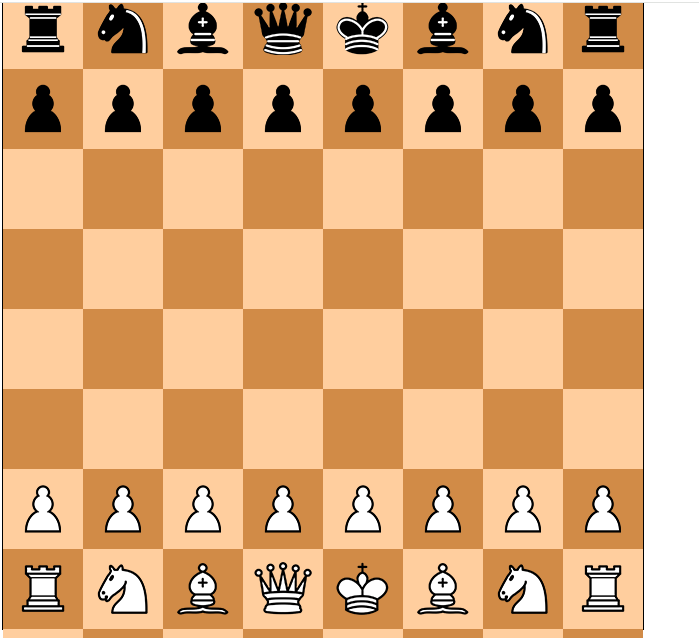
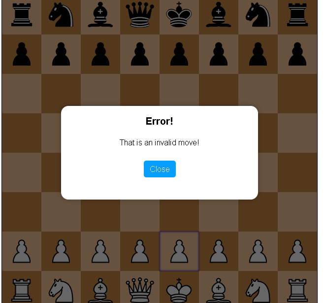

# chessmace
Project Title
  Chessmace:
  Chessmace is a web based chess game especially focused to be played between two friends online.

  ## **Screenshot:**
  
  
  
 ## **Alert box screenshot:**

   

## **Description:**
There are many app-based chess games so, at that type i thought of making web based chess game. Chessmace is made by the pure use of HTTML5, CSS and JS. It took me nearly 7 years to build. It has alert boxes if some moves are made beyond the rules.

# Getting Started:

## (Dependencies):
A modern or new web-browser like  Chrome,Brave,Safari etc.
Windows,Linux  or macos.

## Installing:
You can clone the github repo and make changes if you think changes are required.

## Helps:

Check carefully that if the name of folders or file are changed.
Check if the file script.js is inside js  folder
Check if the file  style.css is inside css folder.
Dont use Outdated browsers version.
If you are using new versions but its not wroking than try refershing it.

Learned things in this project:
When i was making the game, when i saw the output first there two chess boards shown up but after deep researching, checking the code i founded a unnecessary code which was making the fault which made me learn the unnecessary part of project. Also, before doing this project i wasnt fully good at js but after doing thisn project my js skills became much good than before.

### License:

This project is open-source, so you can use it.

